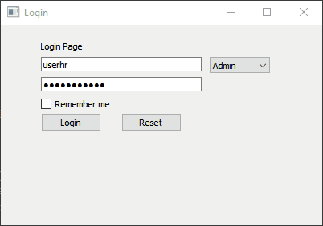
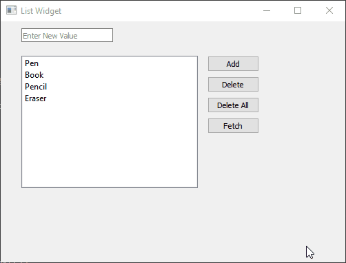
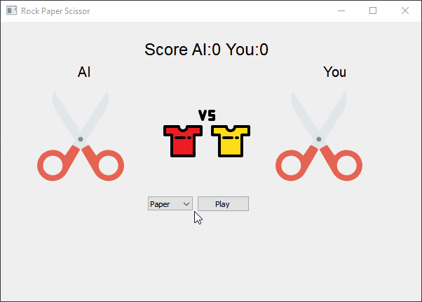

# Solid-Potato

Intended to share PyQt5 code for suggestions and clarifications

### Login Page



### List Widget



### Rock Paper Scissor Game



## Installation

Use the package manager [pip](https://pip.pypa.io/en/stable/) to install the necessary packages

```bash
pip install -r requirements.txt
```

## Usage

```bash
python main.py
```

## License

[MIT](https://choosealicense.com/licenses/mit/)
